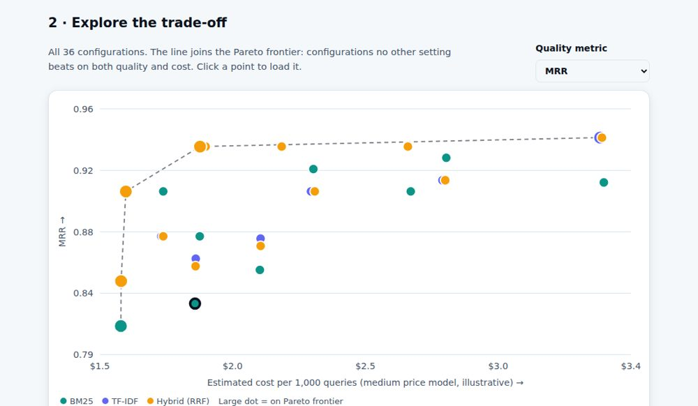
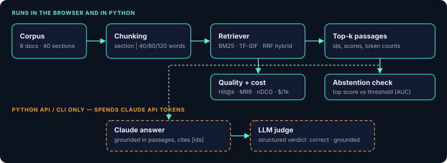

# LLM Eval Lab

**Live demo:** https://singhvar24.github.io/llm-eval-lab/ · **Portfolio:** https://singhvar24.github.io/

[](https://singhvar24.github.io/llm-eval-lab/)

A small, honest toolkit for answering a practical RAG question: **which retrieval configuration is worth its cost?**
It evaluates chunking strategy × retriever × top-k on retrieval quality, estimated prompt cost and measured latency, and shows the Pareto frontier.

   

## What is in the box

| Part | Path | Notes |
|---|---|---|
| Python toolkit | `src/evallab/` | Chunking, BM25, TF-IDF cosine, hybrid (reciprocal-rank fusion), metrics, cost model, refusal calibration, CLI |
| Claude API layer | `src/evallab/llm.py` | Grounded, cited answers with abstention, and an LLM-as-judge with structured output (official `anthropic` SDK) |
| REST API | `src/evallab/api.py` | FastAPI: `/health`, `/search`, `/evaluate`, `/sweep`, `/abstention`, `/answer` (validated inputs, OpenAPI docs at `/docs`) |
| In-browser demo | `index.html`, `web/` | Vanilla JS port of the offline parts: trade-off chart, refusal-calibration curve, question-by-configuration heatmap, inspector, free-text search |
| Dataset | `data/` | Synthetic mortgage-insurance handbook (8 documents, 40 sections), 32 answerable questions with gold sections, 10 out-of-scope questions |
| Tests / CI | `tests/`, `.github/workflows/ci.yml` | pytest, Node parity tests, ruff, data-regeneration check, Docker build + health check |
| Container | `Dockerfile` | Runs the API with uvicorn |



```
data/*.json ──► chunking ──► retriever (BM25 | TF-IDF | RRF hybrid) ──► top-k chunks
                                                            │
                          metrics: Hit@k, MRR, nDCG@k, Precision@k   │
                          extractive answer ► Answer F1              ▼
                          prompt tokens ► est. cost / 1k queries     Pareto frontier
```

## Quick start

```bash
pip install -e ".[dev]"
evallab sweep                 # table of the best configurations (add --out results.json)
evallab search "how long are records kept" --retriever hybrid -k 3
evallab abstain --retriever tfidf       # can the top retrieval score separate out-of-scope questions?

# Claude API (spends tokens on YOUR account; needs ANTHROPIC_API_KEY or `ant auth login`)
pip install -e ".[llm]"
evallab generate "How many days does the lender have to lodge a claim?"
evallab eval-llm --limit 5 --yes        # prints the plan and cost estimate; refuses to run without --yes
uvicorn evallab.api:app --reload      # http://127.0.0.1:8000/docs
pytest -q && node --test tests/parity.test.mjs
python -m http.server 8000    # then open http://localhost:8000/ for the demo
```

## Claude API layer

* `answer_question` sends the retrieved passages (with ids) and the question to **Claude Opus 5.5** (`claude-opus-5-5`, override with `--model`) at `effort: low`. The system prompt requires citations like `[d03-s2]` and the exact reply `NOT_IN_DOCUMENTS` when the passages lack the answer. Cited ids that were not retrieved are discarded; `refusal` and `max_tokens` stops are surfaced rather than hidden.
* `judge_answer` grades a candidate against the reference answer and the passages with structured output (`messages.parse`), returning `correct`, `grounded` and a short rationale.
* Costs printed by the CLI use list prices cached on 2026-09-25 in `llm.py` — verify them against Anthropic's pricing page.
* **Not yet run against the live API.** The code is covered by mocked tests (prompt construction, citation filtering, abstention, refusal/truncation, missing-credentials handling, the `/answer` endpoint), but no real Claude call was made while building this, so expect to tune the prompt once you run `eval-llm`.
* The browser demo deliberately never calls an LLM or asks visitors for a key.

## Refusal calibration

`evallab abstain` asks whether "abstain when the top retrieval score is below *t*" separates the 32 answerable questions from 10 out-of-scope ones. On this dataset BM25 and TF-IDF reach an AUC of about 0.86 and 0.84, whereas the RRF hybrid scores sit near 0.5 because fused scores depend only on rank. Raw BM25 scores are not calibrated across queries, so this is a diagnostic rather than a production rule.

## Method

* **Chunking:** per section, or sliding word windows (40/80/120 words, 25 % overlap). A chunk is *relevant* when it overlaps the gold section.
* **Retrievers:** BM25 (k1 = 1.5, b = 0.75); TF-IDF cosine with sublinear tf; hybrid = reciprocal-rank fusion (k = 60; Cormack et al., SIGIR 2009).
* **Metrics:** Hit@k, MRR@k, binary-relevance nDCG@k, Precision@k, and token-overlap F1 of an extractive answer against a reference answer.
* **Cost:** prompt tokens = system (60) + question + retrieved chunks, using ~1.3 tokens per word; output fixed at 80 tokens. Prices in `data/pricing.json` are **illustrative placeholders, not real vendor prices** — edit them.
* **Latency:** mean wall-clock retrieval time per query on the machine running it.

## Limitations (please read)

* The corpus and questions are **synthetic and small** (32 questions). Many configurations land within a few points of each other, so differences are indicative, not statistically significant.
* **No LLM is called.** Answer quality comes from a deterministic extractive baseline, so "Answer F1" measures retrieval + sentence selection, not generation. The `extractive_answer` function is the intended plug-in point for a Bedrock or Anthropic-API generator; that integration is **not implemented here**.
* The fictional insurer and all figures in the corpus are invented and do not describe any real product or company.
* The Docker image was not built locally (no Docker daemon was available); the CI `docker` job is its first test.

## Parity between Python and the browser

`web/evallab.js` re-implements the Python code. `scripts/make_golden.py` writes the Python results for all 36 configurations to `tests/golden/metrics.json`, and `tests/parity.test.mjs` asserts the JavaScript reproduces them (metrics to 1e-9, plus per-question hits and ranks).

## Publishing the demo

Settings → Pages → *Deploy from a branch* → `main` / `(root)`. The site is plain static files; no build step.

The first GitHub Actions run (pytest, Node parity test, ruff, data check) passed; the Docker job was added afterwards.

## Author

Built by [Varnika Singh](https://singhvar24.github.io/) — Graduate AI Engineer, Sydney. MIT licensed.
